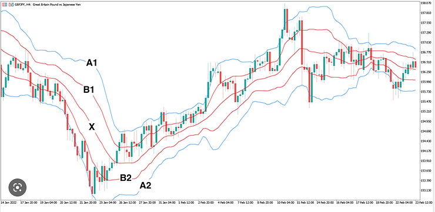
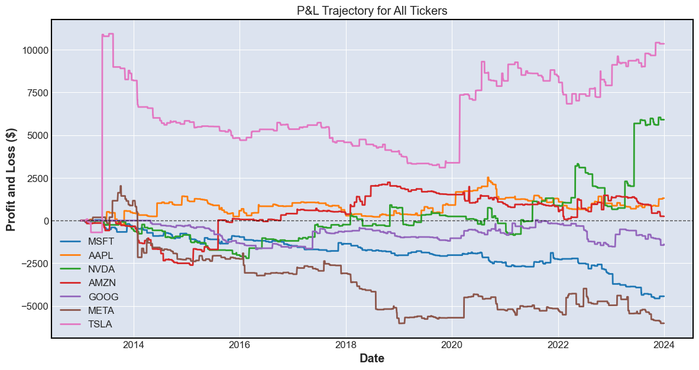
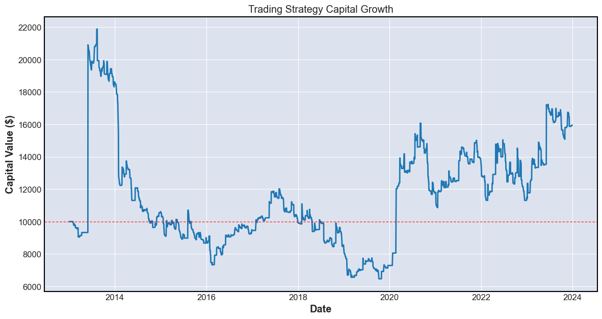

# Magnificent 7 Backtesting

This repository contains the code for a backtesting software to evaluate the performance of the double Bollinger band strategy by [Kathy Lien](https://www.3candlereversal.com/post/kathy-lien-s-double-bollinger-band-strategy) on the Magnificent 7 (Mag-7).

## Double Bollinger Band Strategy

The Double Bollinger Band Strategy provides clear signals for trading:

- **Buy** when the price is between lines A1 and B1.
- **Sell** when the price is between lines B2 and A2.



*Image credit: [3 Candle Reversal](https://www.3candlereversal.com/post/kathy-lien-s-double-bollinger-band-strategy)*

## Project Structure

The project is organized into the following directories and files:

- `assets`: Contains images produced from the analysis.
- `src/`: Contains Python scripts for analysis and implementation.
- `README.md`: Provides an overview of the project.
- `requirements.txt`: Includes necessary packages and imports to run the scripts in this project.

## Files

- `backtest.ipynb`: A Jupyter Notebook that walks through the following steps:
  1. **Indicator Implementation**: Calculates and implements double Bollinger Bands and other necessary indicators.
  2. **Strategy Backtesting**: Applies the double Bollinger Band strategy to Mag-7 stocks over an 11-year period, generating trade signals and executing simulated trades.
  3. **Performance Evaluation**: Analyzes the strategy's performance with summary statistics, visualizations, and metrics such as total return, annual return, volatility, and drawdowns.
  4. **Strategy Improvements**: Suggests potential enhancements, such as incorporating implied volatility to create forward-looking bands based on backtesting results.

## Usage

To run the project or execute scripts, follow these steps:

1. Clone this repository:

   ```bash
   git clone https://github.com/RamblingRaccoon/mag7_backtest.git
   cd mag7_backtest
   ```

2. Install the required dependencies:

   - Ensure Python is installed.
   - Ensure required Python packages are installed using:

      ```bash
      pip install -r requirements.txt
      ```

3. Explore the files:

   - `backtest.ipynb`: Contains backtests, analysis, and insights for the double Bollinger band trading strategy on the Mag-7.

## Results

The table below summarizes the backtesting results over an 11-year period from January 1, 2013, to December 31, 2023:

| Statistic            | Value  |
|----------------------|--------|
| Total Return         | 59.57% |
| Annual Return        | 4.35%  |
| Annual Volatility    | 47.52% |
| Sharpe Ratio         | 0.05   |
| Sortino Ratio        | 0.0    |
| Maximum Drawdown     | -70.42%|

The strategy suffers from significant drawdowns, high volatility, and modest returns. This is shown by the Sharpe and Sortino ratios of 0.05 and 0.00, respectively, indicating poor risk-adjusted performance.

A risk-free rate of 2.02%, sourced from [FRED](https://fred.stlouisfed.org/series/DGS10) at the start of 2013, was used for the calculations.

## Analysis

Examining the cumulative Profit & Loss (P&L) trajectory across all tickers reveals that the strategy's returns are primarily driven by just two companies: TSLA and NVDA. In contrast, GOOG, MSFT, and META experienced losses by the end of the 11-year period.



With a starting capital of $10000, the capital trajectory confirms our summary statistics, illustrating periods of substantial drawdowns and significant volatility, both upward and downward, with only modest overall returns.



## Potential Improvements

The double Bollinger band strategy effectively uses volatility data to create Buy, Sell, and Neutral zones, identifying periods of strong trends. However, Bollinger Bands are based on historical volatility and may not account for significant upcoming events like Earnings Releases, News, or Federal Reserve decisions, which can notably impact the technology sector. For instance, NVIDIA's announcement of the Blackwell Platform on March 18, 2024, led to a rally of approximately 6% by March 22, 2024 ([NVIDIA News](https://nvidianews.nvidia.com/news/nvidia-blackwell-platform-arrives-to-power-a-new-era-of-computing)).

To enhance the strategy, we can incorporate implied volatility from the options chain for each ticker. By calculating the expected move within a given timeframe using implied volatility, we can create 1-SD and 2-SD expected move bands. These bands, similar to Bollinger Bands, reflect the market's forecasts of volatility and can make the strategy more responsive to upcoming events and news. For more details, refer to [backtest.ipynb](./src/backtest.ipynb).

## Acknowledgements

I would like to acknowledge Kathy Lien for her development of the double Bollinger band strategy. Her original work provides the foundation for this strategy and can be explored in her publications.

Additionally, the strategy was repackaged and presented by [3 Candle Reversal](https://www.3candlereversal.com/post/kathy-lien-s-double-bollinger-band-strategy). They provided the detailed description and analysis used in this backtesting.

## License

This project is licensed under the [MIT License](LICENSE).
